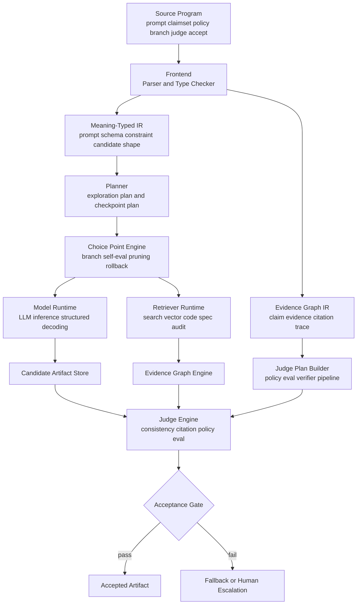

# Kriteia言語設計詳細

[Noesis.md](Noesis.md) の「探索・推論・分岐・バックトラッキング」と、[追加のAIネイティブ言語アイディア.md](追加のAIネイティブ言語アイディア.md) の Anchor が持つ「根拠・検証・受理・監査」を統合し、AIネイティブ言語の単一案として再構成したものが Kriteia である。本案は、AI アプリケーションの本質を「候補を生成し、探索し、根拠を集め、検証し、受理された成果物だけを外へ出す一連の計算」として定義し直す。

## 統合アイディア: Kriteia

* **キャッチコピー**: 推論して終わらず、根拠で受理するAIネイティブ言語
* **ターゲット層と主なユースケース**: LLM エージェント基盤、RAG システム、コード生成、構成レビュー、セキュリティ診断、法務・医療・金融の高説明責任システム、AI を内部統制付きで本番運用したい開発チームを主対象とする。特に、「探索はできるが、そのまま公開や実行には使えない」という現場に向く。
* **解決する既存言語の課題**: Python や TypeScript による AI アプリケーションは、モデル呼び出し、検索、引用付け、評価、検証、再試行、監査ログが別々のライブラリや設定へ散りやすい。Noesis は探索・分岐・制約付き推論を強く扱えるが、最終成果物をどの条件で本番採用してよいかは実装者の責務として残りやすい。Anchor は受理条件と根拠を中心に据えたが、探索そのものの記述力は Noesis ほど強くない。Kriteia はこの二者を統合し、推論と受理を一つの言語ライフサイクルへまとめる。
* **コアとなる言語仕様とパラダイム**: パラダイムは「意味型付き推論 + 証拠指向生成 + 評価駆動受理」である。実行モデルは、コンパイル時に Meaning-Typed IR と Evidence Graph IR の二重中間表現へ落とし込み、実行時は AI ランタイムが探索、検索、検証、採否判定を統合処理する。第一級概念は `prompt`、`branch`、`checkpoint`、`claimset`、`evidence`、`judge`、`accept` である。候補出力は単なる文字列ではなく、主張集合と根拠集合を備えた「候補成果物」として扱われ、評価を通過したときのみ `accepted artifact` へ昇格する。
* **特徴的なシンタックスの例**:

```kriteia
claimset ReviewReport {
    summary: Text
    findings: List<Finding>
    confidence: Score<0.0..1.0>
}

prompt ReviewPrompt(repo: RepoSnapshot) -> ReviewReport

policy ReleaseGate {
    require grounded(findings)
    require confidence >= 0.85
    require pass Eval.Relevance(min: 0.80)
}

agent SecureReviewer(model: "gpt-5.4") {
    explore analyze(repo: RepoSnapshot) -> accepted ReviewReport {
        checkpoint before_external_effects

        let candidate = think<ReviewReport>(ReviewPrompt(repo))

        branch finding in candidate.findings width 4 score by self_eval(finding, repo) {
            require finding.severity != "critical" or has_evidence(finding)
            retrieve CodeSearch(repo, finding)
        }

        let judged = judge candidate
            using CitationVerifier
            using ConsistencyCheck
            using PolicyChecker(ReleaseGate)

        accept judged
    } fallback {
        rollback before_external_effects
        return accepted ReviewReport {
            summary: "自動受理に失敗したため人手レビューへ切り替える"
            findings: []
            confidence: 1.0
        }
    }
}
```

注記: この節のコード例は構想段階の表記を一部残している。第1版正文では `accept judged` のように `accept` は文として扱う。一方、`return accepted ReviewReport { ... }` のような `accepted` 値の直構築は、現行の opaque wrapper 方針では正規構文としては扱わず、人手受理済み値または受理済み出力経路の概念的省略記法として読む。

この構文では、`think` が候補生成を担い、`branch` が分岐探索と枝刈りを管理し、`judge` が根拠・整合性・ポリシーを検査し、`accept` が最終的な公開可能成果物への昇格を担う。重要なのは、探索と検証が別システムに分離されていない点である。Kriteia は「AI に考えさせる」だけではなく、「何を通してよいか」を言語の中心に置く。

---

## 1. なぜ統合するのか

AIネイティブ言語には、大きく二つの方向がある。

* 推論探索を言語化する方向
* 根拠付き受理を言語化する方向

Noesis は前者の代表であり、意味的型システム、Tree-of-Thought、バックトラッキング、確率的制約制御に強い。Anchor は後者の代表であり、claim、evidence、judge、accept を中心に、AI 出力の採否を管理する。

しかし、実際の AI アプリケーションはこの二つを別々には動かさない。現実には次の順で一続きに動く。

1. 候補を生成する。
2. 候補を比較し、枝を刈る。
3. 必要な根拠を集める。
4. 出力形式、整合性、ポリシーを検証する。
5. 基準を満たしたものだけを採用する。

Kriteia は、この五段階を一つの言語の正式な計算モデルへ昇格させる。

## 2. Kriteiaの中心思想

Kriteia の中心思想は次の四点に要約できる。

* モデル出力は常に「候補」であり、初期状態では信用されない。
* 候補は分岐探索と根拠収集の両方を経る。
* 検証されていない候補は外部公開や自動実行に使えない。
* accept された成果物だけが正式な値として関数境界を越えられる。

これは、静的型付けが「どんな値が API 境界を通れるか」を定義したのと同じように、AI 出力に対して「どんな候補が業務境界を通れるか」を定義する考え方である。

## 3. パラダイムと実行モデル

Kriteia のパラダイムは以下の三要素から成る。

* **意味型付き推論**: prompt と schema は意味情報を持つ。
* **証拠指向生成**: 出力は evidence graph と結び付く。
* **評価駆動受理**: policy と eval を通過したものだけを受理する。

実行モデルは四段階の状態機械として理解できる。

1. **Plan**: prompt と入力型から探索計画を構築する。
2. **Explore**: 候補生成、分岐、自己評価、枝刈りを行う。
3. **Ground**: retrieval、引用検証、整合性確認を行う。
4. **Accept**: policy と metric を満たした候補のみ accepted 型へ昇格する。

この四段階がランタイムの正式な状態遷移を構成することで、AI アプリケーションの流れが明示的になる。

## 4. 第一級概念

## 4.1 prompt

`prompt` は単なる文字列テンプレートではなく、意味型付きの生成契約である。

```kriteia
prompt IncidentPrompt(ctx: IncidentContext) -> RemediationPlan
```

ここでコンパイラは、入力型、期待出力、制約候補を Meaning-Typed IR に保持する。

## 4.2 claimset

`claimset` はモデルが生成する成果物の構造と、その中の主張集合を表す。

```kriteia
claimset RemediationPlan {
    summary: Text
    steps: List<Action>
    confidence: Score<0.0..1.0>
}
```

claimset は DTO ではなく、検証対象となる主張集合である点が重要である。

## 4.3 evidence

`evidence` は retrieval 結果、文書断片、コード行、監査記録などの根拠を表す。各 claim は evidence graph 上のノードと関連付けられる。

```kriteia
evidence RepoLine
evidence SpecSection
evidence AuditRecord
```

## 4.4 branch

`branch` は Noesis 由来の探索構文であり、複数候補を並行展開し、自己評価や制約に基づいて枝刈りする。

```kriteia
branch step in plan.steps width 6 score by self_eval(step, ctx) {
    require executable(step)
}
```

## 4.5 checkpoint / rollback

探索と検証の途中で副作用を扱うため、状態保存と巻き戻しを正式なランタイム機能として持つ。

```kriteia
checkpoint before_external_effects
rollback before_external_effects
```

これにより、探索失敗や judge 不合格時に安全な地点へ戻れる。

## 4.6 judge

`judge` は候補成果物に対して複数の検証器を適用するステージである。

```kriteia
let judged = judge candidate
    using CitationVerifier
    using ConsistencyCheck
    using PolicyChecker(ReleaseGate)
```

judge の結果は bool ではなく、失敗理由、根拠不足箇所、改善提案を含む構造化値になる。

## 4.7 accept

`accept` は AI 出力を正式な公開成果物へ昇格する唯一の手段である。

```kriteia
accept judged
```

accepted 型を持たない値は、外部 API 応答や自動アクションの入力に使えない。

## 5. ランタイムアーキテクチャ

Kriteia のランタイムは、単なる LLM SDK ではなく推論 VM に近い。

### 5.1 Meaning-Typed IR

コンパイラは prompt、schema、policy、evaluation 条件を保持した意味型付き IR を生成する。これにより、生成要求が単なる文字列操作へ崩れにくい。

### 5.2 Choice Point Engine

Noesis 由来の探索機構であり、branch ごとの候補、スコア、制約違反、再探索地点を管理する。

### 5.3 Evidence Graph Engine

Anchor 由来の検証機構であり、claim と retrieval 結果、引用元、検査結果をグラフとして保持する。どの主張がどの根拠で支えられるかを説明できる。

### 5.4 Constraint Synthesizer

Noesis の自動制約生成を継承し、自然言語的な要件を形式制約へ落とす。生成時と judge 時の両方で使われる。

### 5.5 Acceptance Gate

最終的に groundedness、policy、metric を統合判定し、accepted artifact への昇格可否を決める。

## 5.6 コンパイラ/ランタイム構成図

以下は、Kriteia のコンパイルから実行までの責務分担を示した概略図である。



この構成のポイントは、コンパイラが単一の IR ではなく、意味情報を保持する IR と根拠グラフ IR を分けて持つ点にある。前者は探索の質を高め、後者は説明可能性と受理判定を支える。Kriteia は「生成器」と「検証器」を別プロセスで後付け接続するのではなく、両者が最初から同じコンパイル成果物を共有するよう設計されている。

## 6. ユースケース

注記: この章のユースケース例は構想段階の表記を一部残している。現行の第1版正文では `accept judged` のように `accept` は文として扱う。また `-> accepted T` の戻り型注釈は受理済み出力境界の概念表現として読めるが、`accepted` 値の直構築が現れた場合は opaque wrapper 化前の概念的省略記法として解釈する。

## 6.1 高説明責任RAG

法令、社内規程、契約書、設計仕様を使う回答生成では、答えの内容だけでなく「どこに基づくか」が重要になる。Kriteia は retrieval と acceptance を統合できる。

## 6.2 AIコードレビュー

指摘内容、該当行、規約根拠、重大度、受理条件をまとめて管理できるため、ただのコメント生成で終わらないレビュー基盤を構築しやすい。

## 6.3 半自動運用と復旧支援

復旧案や是正案を複数探索しつつ、根拠と安全性検証を通ったものだけを自動提案または自動適用候補に昇格できる。

## 6.4 評価付きエージェント

一定評価を下回る候補は採用せず、人手へエスカレーションするような agent を言語レベルで自然に書ける。

## 6.5 契約レビュー支援

契約書レビューでは、単にリスク条項を列挙するだけでは足りず、どの条文を根拠にし、どの社内基準に照らして問題とみなしたかまで必要になる。Kriteia は、契約条項を claimset として生成し、社内ひな形、法務ガイドライン、過去レビュー履歴を evidence として接続したうえで、accept gate によって「法務部へ出してよいレポート」だけを生成できる。

```kriteia
claimset ContractReview {
    summary: Text
    clauses: List<ClauseRisk>
    confidence: Score<0.0..1.0>
}

policy LegalGate {
    require grounded(clauses)
    require confidence >= 0.90
    require pass Eval.PolicyAlignment(min: 0.88)
}

flow review(contract: ContractText) -> accepted ContractReview {
    let candidate = think<ContractReview>(ContractPrompt(contract))
    let judged = judge candidate
        using ClauseCitationVerifier
        using PolicyChecker(LegalGate)
        using HallucinationCheck
    accept judged
}
```

## 6.6 セキュリティ是正提案

脆弱性レポートや IaC 設定ミスに対する是正提案では、候補が実行可能であり、かつ過剰修正でないことが重要である。Kriteia は branch によって複数の是正案を探索し、judge 段階でポリシー準拠、影響範囲、再発防止の観点から採否を決められる。

```kriteia
claimset RemediationPatch {
    summary: Text
    edits: List<Edit>
    blast_radius: Score<0.0..1.0>
    confidence: Score<0.0..1.0>
}

policy PatchGate {
    require confidence >= 0.87
    require blast_radius <= 0.35
    require pass Eval.Buildability(min: 0.95)
}

agent PatchAdvisor(model: "gpt-5.4") {
    explore fix(input: RepoSnapshot) -> accepted RemediationPatch {
        let patch = think<RemediationPatch>(FixPrompt(input))

        branch edit in patch.edits width 5 score by self_eval(edit, input) {
            require compiles_after(edit)
            retrieve CodeSearch(input, edit)
        }

        let judged = judge patch
            using BuildVerifier
            using CitationVerifier
            using PolicyChecker(PatchGate)

        accept judged
    }
}
```

## 6.7 運用手順の自動ドラフト生成

SRE や運用チーム向けの手順生成では、実行コマンドの安全性、前提条件、ロールバック手順の有無が重要になる。Kriteia は、探索段階で複数の復旧パスを比較し、judge 段階で「危険な手順を受理しない」ようにできる。

```kriteia
claimset RunbookDraft {
    title: Text
    prechecks: List<Check>
    actions: List<Action>
    rollback: List<Action>
    confidence: Score<0.0..1.0>
}

policy RunbookGate {
    require confidence >= 0.88
    require exists(rollback)
    require grounded(actions)
}
```

## 6.8 モデル審査付きコード生成

コード生成で重要なのは、生成そのものより「組織の規約、テスト、依存制約を満たしたコードだけを通す」ことである。Kriteia では codegen を最初から judge/accept 前提の候補生成として扱えるため、CI 直結の生成ワークフローを記述しやすい。

## 6.9 ユースケースに共通する価値

これらの例に共通するのは、AI が直接「正解」を返すのではなく、「受理候補を生成する」立場に限定されている点である。Kriteia の強みは、この制約を運用ルールではなく、言語仕様として強制できるところにある。

## 7. 既存案との差分

### 7.1 Noesis単体との差分

Noesis 単体では探索、制約、rollback が中心であり、「どの候補を本番へ出してよいか」は実装者が別途定義しやすい。Kriteia は accept を正式な言語概念にし、その責務を言語へ引き戻す。

### 7.2 Anchor単体との差分

Anchor 単体では、根拠付き受理と評価は強いが、探索木の扱いや再探索構文は比較的弱い。Kriteia は branch、checkpoint、自己評価、確率的枝刈りを統合し、候補生成段階の表現力を強化する。

### 7.3 PythonやTypeScriptとの差分

既存汎用言語では、prompt、retrieval、validation、eval、policy が複数のライブラリや設定へ分散する。Kriteia はそれらを一つの制御フローと型モデルへまとめる。

## 8. 強み

* 探索から受理までのライフサイクルが一つの言語へ収まる。
* AI 出力を accepted 型へ昇格させる明確な gate を持つ。
* 根拠、評価、採否が実行モデルの中心仕様になる。
* 高説明責任領域で監査しやすい。
* 「モデルを呼ぶコード」ではなく「AI 成果物を選別するコード」が書ける。

## 9. 弱点とトレードオフ

* 単純なチャットボットや軽量生成用途には重い。
* accepted 型、judge、evidence graph の概念は学習コストを伴う。
* ランタイム実装は相応に複雑で、軽量 SDK にはなりにくい。
* すべてを acceptance gate に通すと、安全性の代わりに速度を失う場面がある。

したがって Kriteia は、生成コストより誤りコストのほうが高い領域に向く。

## 10. まとめ

Kriteia は、Noesis の「探索する AI 言語」と Anchor の「受理する AI 言語」を統合し、AI システムの中心問題を「候補を生成し、根拠を集め、検証し、受理された成果物だけを通す」一連の計算として定義する。

この統合により、AI ネイティブ言語は単なる prompt DSL や agent orchestration DSL を超え、生成、探索、根拠、評価、採否を一体化した実行環境へ進化する。Kriteia の新規性は、思考探索と根拠付き受理を別段階の実装責務として扱わず、両者を同じ言語の中心概念へ昇格させた点にある。これは、AI を「賢い関数」として使うのではなく、「採用可能な成果物を生成する不確実計算系」として扱うための、より完成度の高い AI ネイティブ言語案である。
